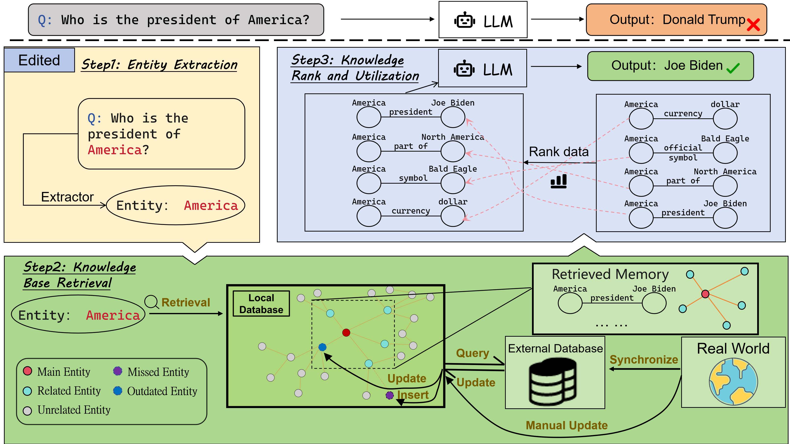

# FAME: Towards Factual Multi-Task Model Editing

This is the official code repository for the EMNLP 2024 paper [FAME: Towards Factual Multi-Task Model Editing](https://arxiv.org/abs/2410.10859v1).

## Setup Instructions

To run the code, follow these steps:

   ```bash
   git clone https://github.com/BITHLP/FAME.git
   cd fame
   conda create -n fame python==3.11.5
   conda activate fame
   pip install -r requirements.txt
   ```

## Running the Model

   ```bash
   cd ./code/model
   python default_batch_qa.py
   ```

## Evaluating the Results

Once the model has finished running, follow these steps to calculate accuracy:

   ```bash
   cd ../scripts
   python cal_acc.py
   ```

## Demo Information

This is just a demo to showcase our FAME dataset and the basic workflow of SKEME. However, there are some network-related bugs in the online query part of SKEME. We are working on fixing these bugs and will upload the complete version of the code soon.

### TODO:
- Upload the full code
- Upload the process for RQs